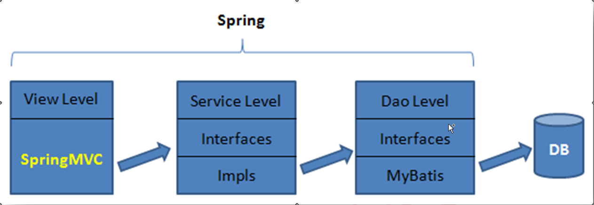

[TOC]

---

# 1. SpringMVC 概述



## 1.1 SpringMVC简介

-   SpringMVC:Spring web mvc:是属于表现层的框架:是spring框架的一部分:发布于Spring3.0后


-   Spring由四大部分组成:IoC容器(Core),AOP,SpringDao(DAO+ORM),Web(JavaEE+Web)

## 1.2 第一个SpringMVC程序

-   首先创建一个web项目

-   web项目依赖servlet-api-3.1.0.jar与jsp-api-2.3.1.jar

-   maven:

-   ```xml
    <dependency>
        <groupId>javax.servlet</groupId>
        <artifactId>javax.servlet-api</artifactId>
        <version>3.1.0</version>
        <scope>provided</scope>
    </dependency>
    <dependency>
        <groupId>javax.servlet.jsp</groupId>
        <artifactId>javax.servlet.jsp-api</artifactId>
        <version>2.3.1</version>
        <scope>provided</scope>
    </dependency>
    ```

#### Tomcat+Maven+SpringMVC

-   项目结构:

    project

    ​	|  ------ src

    ​			|  ------  main			

    ​					|  ------  java			       源程序文件夹,java程序在此构建

    ​					|  ------  resources		       资源文件夹,资源的classpath

    ​					|  ------  webapp                   web应用文件夹

    ​							|  ------ WEB-INF

    ​									|  ------  web.xml            	web配置文件夹,主要配置servlet

    ​							|  ------  index.jsp             

    ​	|  --- target                   ctrl+shift+alt+s → project → project cpmpiler output     输出文件夹

    ​	|  --- pom.xml

-   pom.xml中添加build标签,子标签plugins,添加插件

    -   ```xml
            <build>
                <plugins>
                    <!--maven jdk 1.8-->
                    <plugin>
                        <artifactId>maven-compiler-plugin</artifactId>
                        <version>3.1</version>
                        <configuration>
                            <source>1.8</source>
                            <target>1.8</target>
                        </configuration>
                    </plugin>
                    <!--servlet容器 jetty插件-->
                    <plugin>
                        <groupId>org.eclipse.jetty</groupId>
                        <artifactId>jetty-maven-plugin</artifactId>
                        <version>9.4.8.v20171121</version>
                    </plugin>
                </plugins>
            </build>
      ```

-   web.xml的头,目前是:

    -   ```xml
        <?xml version="1.0" encoding="UTF-8"?>
        <web-app xmlns="http://java.sun.com/xml/ns/javaee"
                 xmlns:xsi="http://www.w3.org/2001/XMLSchema-instance"
                 xsi:schemaLocation="http://java.sun.com/xml/ns/javaee
                  http://java.sun.com/xml/ns/javaee/web-app_3_0.xsd"
                 version="3.0">
          
        </web-app>
        ```

-   ctrl+shift+alt+s → 配置Artifacts, 名称为项目名:war exploded  构建输出目录为target\项目名

-   tomcat配置页中的On 'Update' action 为Update classes and resources

### 1.2.1 导入jar包

-   除之前的spring的jar包外,增加两个jar包

-   spring-context-support:包含支持UI模板,邮件服务,缓存等方面的类

-   spring-webmvc:对spring-mvc的实现

-   maven:

-   ```xml
    <dependency>
        <groupId>org.springframework</groupId>
        <artifactId>spring-context-support</artifactId>
        <version>5.0.2.RELEASE</version>
    </dependency>
    <dependency>
        <groupId>org.springframework</groupId>
        <artifactId>spring-webmvc</artifactId>
        <version>5.0.2.RELEASE</version>
    </dependency>
    ```

### 1.2.2 注册中央调度器

-   在web.xml中注册中央调度器,是一个servlet

```xml
    <!--中央调度器-->
    <servlet>
        <servlet-name>spring-mvc</servlet-name>
        <servlet-class>org.springframework.web.servlet.DispatcherServlet</servlet-class>
        <init-param>
            <!--spring-context设置-->
            <param-name>contextConfigLocation</param-name>
            <param-value>classpath:springmvc.xml</param-value>
        </init-param>
        <!--随服务器启动-->
        <load-on-startup>1</load-on-startup>
    </servlet>
    <servlet-mapping>
        <servlet-name>spring-mvc</servlet-name>
        <url-pattern>*.do</url-pattern>
    </servlet-mapping>
```

1.  全限定性类名
    -   该中央调度器为一个Servlet,名称为DispatcherServlet
    -   全类名:**org.springframework.web.servlet.DispatcherServlet**

2.  \<load-on-startup/>标签
    -   标记此servlet是否在tomcat服务器启动时创建实例
    -   大于等于0时为容器启动时加载并初始化,数值越小优先级就越高
    -   小于0或没指定时,当使用servlet时才创建实例
    -   当两个servlet的load on startup值相同时,容器自动选择顺序

3.  \<url-pattern/>标签
    -   对于\<url-pattern/> ，不能写为/\*，最好也不要写为/，**建议写为\*.do**
        的形式。详见 1.4 再解\<url-pattern/> 

4.  配置文件与名称

    -   为中央调度器指定spring-context的配置文件路径,一般在resources的根目录下

    -   ```xml
               <init-param>
                   <!--spring-context设置-->
                   <param-name>contextConfigLocation</param-name>
                   <param-value>classpath:springmvc.xml</param-value>
               </init-param>
         ```

### 1.2.3 创建SpringMVC配置文件

-   可任意命名,一般在resources根目录,使用spring配置的最全约束

-   ```xml
    <?xml version="1.0" encoding="UTF-8"?>
    <beans xmlns="http://www.springframework.org/schema/beans"
           xmlns:xsi="http://www.w3.org/2001/XMLSchema-instance"
           xmlns:aop="http://www.springframework.org/schema/aop"
           xmlns:context="http://www.springframework.org/schema/context"
           xmlns:tx="http://www.springframework.org/schema/tx"
           xmlns:p="http://www.springframework.org/schema/p"
           xmlns:c="http://www.springframework.org/schema/c"
           xsi:schemaLocation="http://www.springframework.org/schema/beans
           http://www.springframework.org/schema/beans/spring-beans.xsd
           http://www.springframework.org/schema/aop
           http://www.springframework.org/schema/aop/spring-aop.xsd
           http://www.springframework.org/schema/context
           http://www.springframework.org/schema/context/spring-context.xsd
           http://www.springframework.org/schema/tx
           http://www.springframework.org/schema/tx/spring-tx.xsd">

     </beans>
    ```

### 1.2.4 定义处理器

-   处理器需要实现**Controller接口**

-   ```java
    public class MyController implements Controller {
        @Override
        public ModelAndView handleRequest(javax.servlet.http.HttpServletRequest request, javax.servlet.http.HttpServletResponse response) throws Exception {
            ModelAndView modelAndView = new ModelAndView();
            modelAndView.addObject("welcome", "hello spring mvc world");
            modelAndView.setViewName("/WEB-INF/jsp/welcome.jsp");
            return modelAndView;
        }
    }
    ```

-   ModelAndView类中的addObject()方法用于向model中添加数据;Model中可连续添加多个数据

    -   Model底层是一个Map
    -   addObject()方法的返回值是ModelAndView;
    -   addlAllObjects(Map\<String,?> modelMap>方法:添加modelMap中的数据Map集合

### 1.2.5 注册处理器

-   在 springmvc.xml 中注册处理器。不过，需要注意处理器的 id 属性值为一个请求 URI。

    -   当客户端提交该请求时，会访问 class 指定的这个处理器

-   ```xml
        <!--注册处理器,id为一个请求URI-->
        <!--当客户端提交此id的请求时,会访问这个指定的处理器-->
        <bean class="com.sqm.servlet.handler.MyController" id="/hello.do"/>
  ```

### 1.2.6 定义目标页面

-   主页放置链接:`<a href="hello.do">welcome</a>`


-   将modelAndView中的welcome的数据接收

-   ```jsp
    <body>
    	服务端信息:${welcome}
    </body>
    ```

### 1.2.7 视图解析器的注册

-   视图解析器:InternalResouceViewResolver

    -   SpringMVC 框架为了避免对于请求资源路径与扩展名上的冗余，在视图解析器引入了**请求的前辍与后辍的属性**
    -   ModelAndView 中只需给出要跳转页面的文件名即可，对于具体的文件路径与文件扩展名，视图解析器会**自动完成拼接**
    -   内部资源视图解析器:org.springframework.web.servlet.view.InternalResourceViewResolver

-   ```xml
        <!--配置视图解析器-->
        <bean class="org.springframework.web.servlet.view.InternalResourceViewResolver">
            <property name="prefix" value="/WEB-INF/jsp/"/>
            <property name="suffix" value=".jsp"/>
        </bean>
  ```

### 1.2.8 修改处理器

-   将modelAndView中的ViewName设置为"welcome",与视图解析器拼接即可

-   ```java
           modelAndView.setViewName("welcome");
     ```

## 1.3 SpringMVC执行流程


### 1.3.1 执行流程简单分析

1.  浏览器提交请求到中央调度器
2.  中央调度器直接将请求转给处理器映射器
3.  处理器映射器会根据请求，找到处理该请求的处理器，并将其封装为处理器执行链后返回给中央调度器
4.  中央调度器根据处理器执行链中的处理器，找到能够执行该处理器的处理器适配器
5.  处理器适配器调用执行处理器
6.  处理器将处理结果及要跳转的视图封装到一个对象 ModelAndView 中，并将其返回给处理器适配器
7.  处理器适配器直接将结果返回给中央调度器
8.  中央调度器调用视图解析器，将 ModelAndView 中的视图名称封装为视图对象
9.  视图解析器将封装了的视图对象返回给中央调度器
10.  中央调度器调用视图对象，让其自己进行渲染，即进行数据填充，形成响应对象
11.  中央调度器响应浏览器

### 1.3.2 API简要说明

1.  DispatcherServlet
    -   中央调度器，也称为前端控制器，在 MVC 架构模式中充当控制器 Controller
    -   DispatcherServlet是整个流程的控制中心
    -   由它调用诸如处理器映射器、处理器适配器、视图解析器等其它组件处理用户请求
    -   中央调度器的存在降低了组件之间的耦合度
2.  HandlerMapping
    -   处理器映射器，负责根据用户请求找到相应的将要执行的 Handler，即处理器
    -   用于完成将用户请求映射为要处理该请求的处理器，并将处理器封装为**处理器执行链**传给中央调度器
3.  HandlAdapter
    -   处理器适配器，通过 HandlerAdapter 对处理器进行执行，这是适配器模式的应用，通过扩展适配器可以对更多类型的处理器进行执行。中央调度器会根据不同的处理器自动为处理器选择适配器，以执行处理器
4.  Handler
    -   处理器，也称为后端控制器，在 DispatcherServlet 的控制下 **Handler 调用 Service层**对具体的用请求进行处理。
    -   由于 Handler 涉及到具体的用户业务请求，所以一般情况下需要程序员根据业务需求己开发Handler
5.  ViewResolver
    -   视图解析器，负责**将处理结果生成 View 视图**，ViewResolver 首先将逻辑视图名解析为物理视图名，即具体的页面地址，再生成 View 视图对象。最后将处理结果通过页面形式展示给用户
    -   SpringMVC框架提供了很多的 View 视图类型，包括：JstlView、RedirectView 等

### 1.3.3 DispatcherServlet 的默认配置

-   SpringMVC组件的默认配置:

-   | 组件名称   | 默认值                                      |
    | ------ | ---------------------------------------- |
    | 处理器映射器 | BeanNameUrlHandlerMapping<br/>DeafultAnnotationHandlerMapping |
    | 处理器适配器 | HttpRequestHandlerAdapter<br/>SimpleControllerHandlerAdapter<br/>AnnotationMethodHandlerAdapter |
    | 视图解析器  | InternalResourceViewResolver             |

## 1.4 再解\<url-pattern/>标签

### 1.4.1 配置详解

1.  **建议写为\*.do形式**
    1.  在没有特殊要求的情况下，SpringMVC 的中央调度器 DispatcherServlet 的\<url-pattern/> 常使用后辍匹配方式是写为*.do
2.  **不能写为/***
    1.  导致**所有**的服务器请求都会被中央调度器当作controller请求
3.  **最好也不要写为/**
    1.  DispatcherServlet会向**静态资源**获取请求作为一个普通controller请求
4.  配置流程:
    1.  在项目中添加图片:在webapp目录下添加目录images,添加一张图片
    2.  修改index页面:把图片显示在index.jsp上' '
    3.  删除处理器:将注册信息注释掉
    4.  修改\<url-pattrern/>的值
        1.  当值为*.do时,图片正常显示
        2.  当值为/时,图片无法显示

### 1.4.2 静态资源访问

-   经过配置后,当中央控制器的url-pattern设为/后,仍然能访问静态资源

1.  **使用Tomcat中名为default的Servlet**

    -   使用tomcat的默认web.xml,的DefaultServlet,servlet名为default

    -   用于处理各种静态资源访问

    -   直接在自己项目的web.xml中设置default的servlet-mapping,将静态资源的后缀与其关联

    -   ```xml
            <!--静态资源与defaultServlet对应-->
            <servlet-mapping>
                <servlet-name>default</servlet-name>
                <url-pattern>*.jpg</url-pattern>
            </servlet-mapping>
            <servlet-mapping>
                <servlet-name>default</servlet-name>
                <url-pattern>*.js</url-pattern>
            </servlet-mapping>
            <servlet-mapping>
                <servlet-name>default</servlet-name>
                <url-pattern>*.css</url-pattern>
            </servlet-mapping>
      ```

2.  使用 **\<mvc:default-servlet-handler/>**

    -   在springmvc配置文件中加入\<mvc:default-servlet-handler>标签

        -   此标签会将静态资源的访问请求添加到SimpleUrlHandlerMapping的urlMap中,key是请求的URI,value为默认Servlet请求处理器对象DefaultServletHttpRequestHandler,此handler调用了defaultServlet来处理静态资源的访问

        -   ```xml
                <!--添加默认静态访问资源servlet-->
                <mvc:default-servlet-handler/>
          ```

        -   使用\<mvc:...>标签,会添加spring-mvc约束

        -   ```xml
            	   xmlns:mvc="http://www.springframework.org/schema/mvc"

            	   http://www.springframework.org/schema/mvc
                   http://www.springframework.org/schema/mvc/spring-mvc.xsd">
          ```

3.  使用 **\<mvc:resources/>**

    -   spirng-3.0.4后,spring中定义了专门处理静态资源访问请求的处理器**ResourceHttpRequestHandler**

    -   并且添加了**\<mvc:resources/>标签**,专门用于解决静态资源无法访问的问题

    -   spring配置如下:

    -   ```xml
             <!--springmvc处理静态资源-->
            <mvc:resources mapping="/images/**" location="/images/"/>
       ```

    -   mapping:表示对目录的请求,要在此目录下一级加两个星号

    -   loaction:表示静态资源所在目录,这里的目录可以包含WEB-INF下的目录

    -   该配置会把静态资源的访问请求添加到SimpleUrlHandlerMapping的**urlMap**中,key是请求所匹配的uri,value为静态资源处理器对象ResourceHttpRequestHandler

## 1.5 绝对路径与相对路径(回顾)

-   在index.jsp添加一个超链接,跳转到hello.do

-   在超链接中无斜杠开头,而在springmvc.xml中注册id时,其id属性值是斜杠开头:"/hello.do"

-   ```jsp
        <a href="hello.do">welcome</a>
  ```

### 1.5.1 访问路径与资源名称

-   URL:Uniform Resource Locator:统一资源定位地址:由**访问路径**与**资源名称**组成
    -   资源名称指的是要访问资源的直接名称,如welcome.jsp,或要访问资源映射的名称,如servlet的名称,handler的注册名称show.do
    -   访问路径:定位到资源名称的路径
    -   在URL中,访问路径为最后一个斜杠之前(包括斜杠),资源名称为做后一个斜杠之后的内容
        -   http://localhost/springmvc/      ---      为访问路径
        -   index.jsp     ---     为资源名称
    -   根据**访问路径是否可以独立完成资源的准确定位**,可将访问路径分为绝对路径和相对路径

### 1.5.2 绝对路径

-   绝对路径:根据给出的访问路径加资源名称可以准确定位到资源的路径
    -   计算机中:web应用的绝对路径,指带访问协议的路径
    -   如http://localhost/springmvc/index.jsp

### 1.5.3 相对路径

-   相对路径:仅仅根据访问路径与资源名称无法准确定位的路径;**必须要给出参照路径才可以准确定位资源**;参照路径不同,定位的绝对路径也不同

-   在web应用中,相对路径有两种写法,以斜杠开头和不以斜杠开头;这两种的相对路径的参照路径是不同的

    1.  以斜杠开头的相对路径

        -   根据路径所在文件所处的位置分为两种:

        1.  前台路径:

            -   由**浏览器解析执行的代码**中所包含的路径;如html,css,js中的路径,与jsp中的静态部分的路径,如\,\<a href=""/>,\<form action="">\</form>等;css中background:img("");js中window.lacation.href=""等


            -   前台路径的参照路径是web服务器的根路径:http://127.0.0.1:8080/

        2.  后台路径

            -   由**服务器解析执行的代码及文件**所包含的路径;如java代码中的路径,jsp动态部分(java动态代码块)中的路径,xml文件中的路径(xml文件被java代码加载到内存并由java代码解析)
            -   后台路径的参照路径是web应用的根路径:http://127.0.0.1:8080/springmvc/
    
        3.  后台路径特例
    
            -   当代码中使用response的sendRedirect()方法进行重定向时,其参照路径时web服务器的根路径;重定向时,要么写无斜杠的相对路径`response.sendRedirect("welcome.jsp");`要么**写在路径上添加项目名称(推荐)**`response.sendRedirect(request.getContextPath + "/show.jsp"); `
    
    2.  不以斜杠开头的相对路径
    
        -   无论是前台路径还是后台路径,其参照路径都是**当前资源的访问路径**(即在浏览器浏览时访问路径),而不是当前资源的保存路径

### 1.5.4 相关现象解析

1.  为什么页面超链接的 herf 属性值加上斜杠会报错
    1.  原因分析

        -   为什么在 springmvc.xml 中注册处理器时其 name 属性值是以斜杠开头，而 index.jsp 页面中的超链接的 herf 属性值加上斜杠后会报错
        -   springmvc.xml 中注册处理器的<bean/>标签的 id 属性中加上斜杠的路径，是后台路径，其参照路径是当前 Web 应用的根：http://localhost/springmvc/。即指出当前注册的处理器MyController 的资源访问绝对路径是：http://localhost/springmvc/hello.do

    2.  解决办法

        -   若还想加上斜杠，还不想出错，则解决为法就是手工为href 属性值的相对路径上添加项目名称

        -   ```jsp
                <a href="/springmvc/hello.do">welcome</a>
          ```

        -   但这样做不好的是，若在项目发布时项目名称发生了改变，则必须将每一个请求的路径进行变。所以，可以通过 EL表达式**${pageContext.request.contextPath}动态的获取到项目名称**

        -   **pageContext.request.contextPath:jsp中获取目前页面的项目路径**

2.  为什么跳转回 index 页面后地址栏会多出一个 test
    1.  问题重现
        1.  修改 springmvc配置文件

            -   为了构建发生这种异常的场景，在注册处理器时，为该\<bean/>的 id 属性中添加上一个/test，表示模块信息。即表示的意义为，若要访问 MyController  这个处理器，则需要提交请求http://localhost/springmvc/test/hello.do

        2.  修改 index页面

            -   修改 MyController 中 ModelAndView 中指定要跳转的页面为/index.jsp，表示重新返回index 页面，用于模拟当表单数据填写错误后重新返回表单页面的场景

            -   ```jsp
                 <a href="test/hello.do">welcome</a>        
                 ```
                ​```

        3.  修改处理器

            -   ```java
                public class MyController implements Controller {
                    @Override
                    public ModelAndView handleRequest(javax.servlet.http.HttpServletRequest request, javax.servlet.http.HttpServletResponse response) throws Exception {
                        return new ModelAndView("/index.jsp");
                    }
                ```

            -   项目发布运行后，在 index 页面中点击链接，可以正常返回 index 页面。但若此时再次点击这个链接，会抛出 404 异常。然后却发现地址栏**多出了一个test**

    2.  原因分析

        -   超链接中的href为无斜杠的相对路径,其参照路径为当前访问路径第一次点击时访问的是http://127.0.0.1:8080/springmvc/test/login.do
        -   在此访问路径下,其当前访问路径已经发生变化,变为http://127.0.0.1:8080/springmvc/test/,所以就会出错

    3.  解决办法
        1.  **使用斜杠开头的请求路径**

            ```jsp
                <a href="${pageContext.request.contextPath}/hello.do">welcome</a><br/>
            ```

        2.  不使用斜杠开头的请求路径

            -   若不使用斜杠开头的请求，则需要使用 JSP 的\<base/>标签。页面中的\<base/>标签，会在当前页面的资源请求路径前自动加上\<base/>标签所代表的路径，将相对路径变为带访问协议的绝对路径

            -   该方式实际上是修改了不带斜杠的相对路径的参照路径，将由原来的当前访问路径作为参照路径，改为了以 basePath 为参照路径

            -   所以这种方式要求页面中的请求不能以斜杠开头

            -   ```jsp
                <%@ page contentType="text/html;charset=UTF-8" language="java" %>
                <%
                    String path = request.getContextPath();
                    String basePath = request.getScheme() + "://" + request.getServerName() + ":" + request.getServerPort() + path + "/";
                %>
                <html>
                  <head>
                      <base href="<%basePath%>"/>
                    <title>$Title$</title>
                  </head>
                <body>
                    <a href="hello.do">welcome</a><br/>
                <body>
                ```